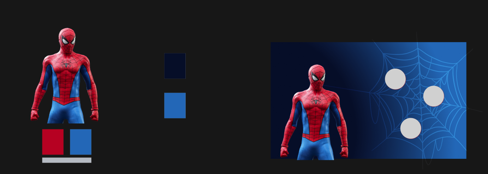

# API - Niels Aling 23/24

This project is the usage pf API's. I wanted to use the movie database API to showcase all the Spider-Man movies. I also used GSAP for some minor animations.

## Inspiration

I used the most famous Spider-Man meme as an inspiration for this website. I wanted have a creative way to show which movies "belong" to what Spider-Man so I thought this was the funniest way to do so.


## Design

I ended up cutting out the Spider-Mans and placed them on a background of the Spider-Man game.


I wanted to give every Spider-Man their own detail page. I wanted them to have their own color pallet and their own web. So I picked the colors from their suit and came up with this design. The movies that match the Spider-Man will be shown in the web.




## Installment

To realize this project I used Express.js as Node.js framework and EJS as templating engine. I started with some basic setup like making a package.json and added some folders to start the project. I installed it as following:

This creates a package.json

```zsh
npm init
```

This installs express

```zsh
npm install express
```

I used [this link](https://expressjs.com/en/starter/hello-world.html) to set up the server.

This installs EJS

```zsh
npm install ejs
```

I used [this link](https://ejs.co/#install) to set-up my website.

After this I made a folder with public for my static content, a folder with views and inside of it a folder with pages (this is were our ejs pages will be) and one with partials (this are components that can be reused).

The last things we need is a .gitignore for the files that should not be send to Github and a .env file for our "secret data".

## Partials

Partials are very useful for content that is used multiple times in your website. Think about a head, scripts, navbar or a footer. In this case I made partials for the head, scripts and some smaller other content.

This is an example of a partial:

```html
<meta charset="UTF-8">
<title>Marvel Movies</title>
<link rel="stylesheet" href="/styles/global.css">
```

## Setting Up Server.js

We have create a server.js file and make sure it works with EJS and Express. the In the top of the file we make sure it can read the .env file and the express and ejs language. We also import the variables from my .env file. We tell Express to use EJS as templating engine and "listen" to our defined port number.

```JS
require("dotenv").config();
const express = require("express");
const router = express.Router();
const app = express();

const PORT = process.env.PORT;
const API_URL = process.env.API_URL;
const API_TOKEN = process.env.API_TOKEN;

app.set("view engine", "ejs");
app.use(express.static("public"));
app.use(router);
app.listen(PORT, function (err) {
  if (err) console.log(err);
  console.log("Server listening on PORT", PORT);
});
```

## Index Page

I started with creating the home page since this does not have any dynamic content. In the head tag you can see I added a partial which I wil explain later. On the home page I inserted the 3 cut out Spider-Mans in a link to their own page.

```html
<!DOCTYPE html>
<html lang="en">
  <head>
    <%- include('../partials/head'); %>
  </head>
  <body>
    <main class="index">
      <a href="/spiderman/tom-holland">
        
      </a>
      <a href="/spiderman/andrew-garfield">
        
      </a>
      <a href="/spiderman/tobey-maguire">
        
      </a>
    </main>
  </body>
</html>
```

In the CSS I placed the background image of the game and gave all the Spider-Mans a scale and border on hover.

```css
.index{
    background-image: url(../images/alley1.jpg);
    background-size: cover;
    background-position: bottom center;

    justify-content: center;
    align-items: flex-end;

    img{
        display: block;
        max-width: 25vw;
        max-height: 80vh;
        transition: all 0.2s;

        &:hover{
            transform: scale(1.05);
            filter: drop-shadow(.2rem .2rem 0px var(--text-color)) drop-shadow(-.2rem -.2rem 0px var(--text-color)) drop-shadow(.2rem -.2rem 0px var(--text-color)) drop-shadow(-.2rem .2rem 0px var(--text-color));
        }
    }
}
```

### Requesting the Home Page

Since we use Express and EJS we have to make sure the content is shown when the client is on a particular url. We do this in our server.js file. Here we tell Express when the client requests the home page url ("/"), it renders the index.ejs page.

```js
// index
app.get("/", async (req, res) => {
  try {
    res.render("pages/index");
  } catch (error) {
    console.error(error);
    res.status(500).send("Internal Server Error");
  }
});
```

## Spider-Man Page

We don't need to make an individual page for each Spider-Man but we can create a "spider-detail" page and insert the right content for the right Spider-Man.

### Requesting Spider-Man Page

First we need to make sure all the data is given for the right Spider-Man page. We create an array with all the data we need. We can use this for images, id's, styling and fetching data.

```js
const spiderArray = [
  {
    id: 1136406,
    slug: "tom-holland",
    name: 'Tom Holland',
    firstName: 'tom',
    img: "/images/tomSuit.png",
  },
  {
    id: 2219,
    slug: "tobey-maguire",
    name: 'Tobey Maguire',
    firstName: 'tobey',
    img: "/images/tobeySuit.png",
  },
  {
    id: 37625,
    slug: "andrew-garfield",
    name: 'Andrew Garfield',
    firstName: 'andrew',
    img: "/images/andrewSuit.png",
  }
]
```

Here we tell Express to render the details page and give the data we fetch to that specific page. With dat data we can create the content. It looks at the name in the slug and uses that to fetch the right movies and select the right data from the "spiderArray". When the page is rendered it sends this data to the EJS spider-details page.

```js
app.get("/spiderman/:name", async (req, res) => {
  const name = req.params.name;
  try {
    const activeSpiderman = spiderArray.filter((spider) => spider.slug === name)[0];
    console.log(activeSpiderman)
    movies = await getMovies(activeSpiderman.id);
    res.render("pages/spider-details", {
      activeSpiderman,
      movies: movies,
    });
  } catch (error) {
    console.error(error);
    res.status(500).send("Internal Server Error");
  }
});
```

In the getMovies function it looks at the id that it received in the request and used this id to fetch the right movies. If this fetch is successful it returns the data.

```js
// get movies
const getMovies = async (id) => {
  try {
    const response = await fetch(url+id, options);
    const json = await response.json();
    console.log(json.results);
    return json.results;
  } catch (error) {
    console.error(error);
  }
};
```

### Inserting Spider-Data

Now we can use the data to build the page. We use the first name of the "active" Spider-Man as an id so we can style the pase based on that. We put the full name of as title and the image that belongs to that Spider-Man in an image tag.

In another section we are going to place all the movies that belong to that Spider-Man. We do this by creating a forEach loop (this means that it will loop through the data and create something for everything it can find). We only want this to happen if the movie is release so inside the forEach loop we create an if statement that says "if the movie has a release date do the following". So for every movie with a release date we create a list item. In that list item we put a link with the right slug and in the link we put an image of the poster.

At the bottom of the page we also insert a partial with scripts. I wil explain this [here](##GSAP).

```html
<!DOCTYPE html>
<html lang="en">
  <head>
    <%- include('../partials/head'); %>
  </head>
  <body class="web" id="<%=activeSpiderman.firstName%>">
    <main>
      <section>
        <h1><%=activeSpiderman.name%></h1>
        " alt="<%=activeSpiderman.name%> in Spider-Man suit" />
      </section>
      <section>
        <div class="movie-container">
          <ul>
            <% movies.forEach(function(movie) { %>
              <!-- if release date exists -->
              <% if (movie.release_date) { %>
                <li class="movie">
                  <a href="<%=activeSpiderman.slug%>/<%=movie.id%>">
                    "
                      alt="<%= movie.title %>"
                    />
                  </a>
                </li>
              <% } %>
            <% }); %>
          </ul>
        </div>
      </section>
      <div id="background-web">
       <%- include(`../partials/web-${activeSpiderman.firstName}`); %>
      </div>
    </main>
    <%- include('../partials/scripts'); %>
  </body>
</html>
```

### Styling the Spider-Man Page

We start by adding specific styling for every Spider-Man.  I created color variables for every Spider-Man based on their suit.

```css
.web {
  &#tom {
    --tom-red: #ca0014;
    --tom-dark: #0b0b0b;
    --tom-light: #2f2f2f;
    --tom-accent: #bbbbbb;

    background: linear-gradient(
      to right top,
      var(--tom-dark) 25%,
      var(--tom-light) 100%
    );

    & svg {
      fill: var(--tom-accent);
    }
  }

  &#andrew {
    --andrew-red: #c91f2d;
    --andrew-dark: #051134;
    --andrew-light: #267bc2;
    --andrew-accent: #c2c6cd;

    background: linear-gradient(
      to right top,
      var(--andrew-dark) 25%,
      var(--andrew-light) 100%
    );

    & svg {
      fill: var(--andrew-accent);
    }
  }

  &#tobey {
    --tobey-dark: #040809;
    --tobey-light: #566988;
    --tobey-red: #d73d3e;
    --tobey-accent: #aaa8a6;

    background: linear-gradient(
      to right top,
      var(--tobey-dark) 25%,
      var(--tobey-light) 100%
    );

    & svg {
      fill: var(--tobey-accent);
    }
  }
```

I created a grid to divide the page in 2 even horizontal sections. The left section is for the Spider-Man mage in their suit and the right section is for the spiderweb with their movies in it.

```css
  main {
    display: grid;
    grid-template-columns: 40vw 60vw;
    position: relative;
  }

  section {
    padding: 2rem;
    padding-bottom: 0;
    height: 100vh;
    display: flex;
    flex-direction: column;

    /* left grid */
    &:first-of-type {
      justify-content: space-between;
    }

    /* right grid */
    &:last-of-type {
      padding: 20vh 2rem;

      .movie-container {
        position: relative;
        height: 100%;
        transform-origin: center center;
      }

      /* posters */
      & ul img {
        width: 8vw;
        width: clamp(2rem, 8vw, 10rem);
        clip-path: circle();
        display: block;
      }

      & ul {
        height: 100%;
        display: flex;
        justify-content: center;
        align-items: center;
      }
```

Here we make sure that every movie is positioned absolute. So later we can give them a random position in a Javascript function. We also make them round and scale them when they are active.

```css
      .movie {
        position: absolute;

        a {
          display: block;
          position: relative;

          &:before{
            content: '';
            position: absolute;
            clip-path: circle();
            transform: scale(1.2);
            background: radial-gradient(rgba(0, 0, 0, 1) 0%, rgba(0, 0, 0, 0) 80%, rgba(0, 0, 0, 0) 100%);
            left: 4px;
            top: 4px;
            height: 100%;
            width: 100%;
            opacity: 0;
          }
          
          &:active{
            cursor: grabbing;
            transform: scale(1.1);

            &:before{
              opacity: 1;
            }
          }
        }
      }
    }
  }

  /* web svg */
  #background-web {
    position: absolute;
    top: 0;
    grid-area: 1 / 1;
    bottom: 0;
    left: 0;
    right: 0;
    z-index: -1;
    mix-blend-mode: color-dodge;
    & svg {
      width: 100%;
      height: 100%;
    }
  }
}

```

### GSAP

We use the GSAP API to make the movies draggable and give them a random position. To do that we first have to import the scripts to be able to use it. I placed them in a partial like I showed before and inserted this into the page. I also add the script in here that I use for the GSAP functions.

```html
<script src="https://cdn.jsdelivr.net/npm/gsap@3.12.5/dist/gsap.min.js"></script>
<script src="https://cdn.jsdelivr.net/npm/gsap@3.12.5/dist/Draggable.min.js"></script>
<script src="/scripts/script.js"></script>
```

After that I made a client side script. In this script I search for the movies. If they exist I give them a random position between 0 and 85%. I also add an easing and give it a stagger (make sure they animate after each other).

Below that I import the draggable plugin and tell it that every movie should be draggable inside the movie-container class.

```js
//random position movies in web
const movies = document.querySelectorAll(".movie");

// position movies randomly
// not above 80% or below 20%
// can't overlap each other
if (movies) {
  gsap.to(movies, {
    top: "random(0, 85)%",
    left: "random(0, 85)%",
    stagger: 0.1,
    ease: 'power4.out'
  });

  // GSAP
  gsap.registerPlugin(Draggable);

  movies.forEach(function (movie) {
    Draggable.create(".movie", {
      bounds: ".movie-container",
      ease: 'power4.out'
    });
  });
}

```

## Movie Details Page

Also the movie details pages do not need their own individual page. We can make this dynamic just as we did with the Spider-Man pages.

### Requesting the Movie Detail Page

In this case the request has 2 parameters: the name of the Spider-Man and the id of the movie. We get these parameters from the slug and need this data to fetch the right movie and cast from the API.

The first thing we have to do is fetch the movie. We do this by inserting the movie id in a fetch url for the movie data and we store this data in the variable "movie".

The second thing we do is inserting the movie id in a fetch url for the cast that matches the movie. We filter this with known_for_department==="Acting" so we make sure that only the actors are shown. Then we store this data in the variable "cast"

When all of this goes well we render the movie-details page and send the movie and cast data with it.

```js
// movie details page
app.get("/spiderman/:name/:id", async (req, res) => {
  try {
    // get id from the movie
    const movieId = req.params.id;
    const response = await fetch(
      `${API_URL}/movie/${movieId}?language=en-US`,
      options
    );
    const movie = await response.json();
    console.log(movie);
    
    const castResponse = await fetch(`${API_URL}/movie/${movieId}/credits?language=en-US` , options);
    const json = await castResponse.json();
    const cast = json.cast.filter((actor) => actor.known_for_department === "Acting");
    console.log(cast);

    res.render("pages/movie-details", {
      movie: movie,
      cast: cast,
    });
  } catch (error) {
    console.error(error);
    res.status(500).send("Internal Server Error");
  }
});
```

### Inserting Movie-Data

We give the body a variable with a dynamic url so we can use this as background-img url in the css file. We will also use this for the banner. Below the banner we inset the movie title and the tagline.

In the main section we show the overview of the movie. This is the description or summary of the movie. We also make a list of all the cast members. Just like we did with all the movies of a specific Spider-Man. In this case we make an if statement that says: "if the castmember has a profile picture do the following". Then we create a list item with an image and the name of the actor.

```html
<!DOCTYPE html>
<html lang="en">
  <head>
    <%- include('../partials/head'); %>
  </head>
  <body
    class="movie-details"
    style="--backdrop-image: url('https://image.tmdb.org/t/p/original<%= movie.backdrop_path %>');"
  >
    <header>
      <div class="banner"></div>
      <h1><%= movie.title %></h1>
      <p><%= movie.tagline %></p>
    </header>
    <main>
        <article>
            <h2>Overview</h2>
            <p><%= movie.overview %></p>
        </article>
        <article class="cast">
            <h2>Cast</h2>
            <ul>
                <% cast.forEach((actor) => { %>
                    <% if (actor.profile_path) { %>
                    <li>
                        " alt="<%= actor.name %>">
                        <h3><%= actor.name %></h3>
                    </li>
                    <% } %>
                <% }); %>
            </ul>
        </article>
    </main>
  </body>
</html>
```

### Styling the Movie-Detail Page

Since we created a variable in the html for the background image we can use this in the css. I added a blur filter on the body background so it would't be to distracting. This created a cool effect with the rest of the page. I gave the text a small shadow to make it more readable and also added the background image into the banner.

```css
.movie-details{ 
    background-image: var(--backdrop-image);
    background-size: cover;
    background-position: center;
    background-attachment: fixed;
    backdrop-filter: blur(10px);

    text-shadow: black 1px 1px 1px;
    padding: 5rem 10rem;
    display: flex;
    flex-direction: column;
    gap: 2rem;

    header{
        display: flex;
        flex-direction: column;
        align-items: center;
        color: var(--white);
        font-size: 1.5rem;
        font-weight: bold;
        
        .banner{
            border: white .5rem solid;
            width: 100%;
            height: 30vh;
            background-image: var(--backdrop-image);
            background-size: cover;
            background-position: top center;
            margin-bottom: 1rem;
        }

    }
```

To structure the page nicely I made sure everything was placed below each other. Just the cast is placed next to each other so you can scroll through them.

```css
    
    main{
        flex-direction: column;
        gap: 1rem;
        height: 100%;
    }

    article{
        padding: 1rem;
        background-color: rgba(0, 0, 0, 0.5);
        height: fit-content;

        &.cast ul{
            display: flex;
            overflow: scroll;
            gap: 1.5rem;

            li{
                display: flex;
                flex-direction: column;
                max-height: 15rem;
                max-width: 7rem;
            }
        }
        
    }
}
```

## Result

I am really happy with the results. I learn a lot about API's like better and cleaner ways to fetch data, insert this data into a templating engine, GSAP (This was completely new to me) and dynamic pages. I really upgraded my game with this project. Special thanks to Cyd Stumpel.


## Resources

- [Cyd Stumpel](https://cydstumpel.nl/)
- [EJS](https://ejs.co/#install)
- [Express](https://expressjs.com/)
- [TMDB](https://developer.themoviedb.org/reference/intro/getting-started)
- [GSAP](https://gsap.com/docs/v3/)